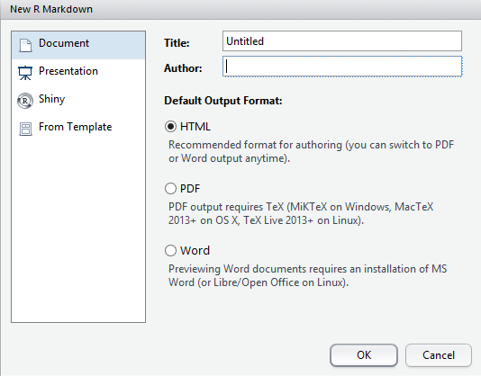
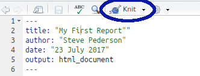
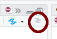

```{r setup, include=FALSE}
knitr::opts_chunk$set(
    echo = TRUE,
    message = FALSE,
    warning = FALSE,
    fig.align = "center",
    results = "hide"
)
if (interactive()) setwd(here::here("Day_1"))
```

## Reproducible Research

In our previous session, we entered our commands directly into the R Console, but *we didn't keep any record of them*.
This really gives minimal advantages over Excel, whereas what we really need to publish our research is an accurate record of everything we've done, so we can write up our Materials and Methods section of the paper, and so we can also communicate with our collaborators.
There is a cheat's way of obtaining our executed code, by looking at the **History** tab in the pane at the top right (next to the **Environment** tab), where you can see a record of every command you've typed.
This will show a record of the last few hundred things you've entered in the Console, but this is of limited use for projects which take weeks or months to work your way through, or where you've tried multiple approaches before settling on your final one.
Keeping a record of your code is vital for communicating with collaborators, and to allow your work to reproducible from a programmatic perspective.

In the 'old days' (pre-2012) people would usually write an R Script, which is a plain text file just containing all the R commands you needed to do for your complete analysis.
This would have included all the code, plus any additional comments or notes, using the `#` symbol to denote a comment.
(Once R sees this symbol, it ignores everything after it until the end of the line)

Nowadays, we have R Markdown, which allows us to execute code, write simply formatted text with explanations of our approach, and to create figures and tables all in the one document — this web page was written with R Markdown.
Using R Markdown is our recommended way of working for the remainder of the course, so let's start an R Markdown file and get exploring

## R Markdown

First we'll show a complete document, then we'll piece together one ourselves throughout the remainder of the day.

1. Go to the `File` drop-down menu in R Studio
2. New File -> R Markdown...

```{r, echo=FALSE, out.width = '90%', fig.align = "center", results='asis'}

```

Once you have that New R Markdown form open

1. Change the Title to: My First Report
2. Change the Author to *your own name*
3. Leave everything else as it is and hit OK
4. Save the file as `RMarkdownTutorial.Rmd`

Notice there are a few different colours here indicating sections and R code, but in essence this is all just plain text.
From here, click the <kbd>Knit</kbd> button at the top of the R Markdown document, and this will produce a beautifully formatted HTML report.

```{r, echo=FALSE, out.width = '50%', fig.align = "center", results='asis'}

```

### What just happened?

R Markdown is an extension of the very common language [*Markdown*](https://en.wikipedia.org/wiki/Markdown), and executable R code.
Let's break that all down a little.

The *header section* for the document is contained between the `---` lines at the top, and this is in a very common format known as YAML.
Importantly, **nothing can be placed before this**, but this is where we have defined our document title, the author's name, the date and the output format.
(We can also compile R Markdown as an MS Word document or as a PDF).
Editing this header is really beyond the scope of this course, but we can get very detailed in this section once we become more advanced users.

Moving on from the header, lines 8 to 10 are what we call a **code chunk** where we have executed R code.
Chunks always begin with `` ```{r}`` and end with `` ``` ``, whilst any executed `R` code goes between these two delineators.
R Studio will helpfully colour these sections in grey to help us see them easily.
Chunk names are optional and directly follow the `r` in the chunk header line.
Here this first chunk is named `setup`.
Other parameters can also be set here after the comma, e.g. do we show/hide the code, and the argument `include = FALSE` is setting this chunk to be hidden from the final document.

There are another two code chunks in this document (lines 18-20 and lines 26-28).
The chunk named `cars` is just printing a summary of an object called `cars` that lives in every R workspace (but is hidden so it doesn't get in the way until needed).

The next chunk (`pressure`) draws a simple plot which you can see in your compiled document.
Notice that here we had the chunk parameter `echo=FALSE` which hides the code from the final document, but still shows the results (_i.e._ the figure).

The code chunks are really the only thing here to do with R and the rest of the formatting is just plain old markdown.
Line 12 is a Section Heading, starting with `##`.
In markdown, the number of hashes indicates the level of the section header.
One has is mainly used for a document title or chapter heading, with increasing numbers indicating sections, subsections, sub-subsections etc.
Click the *staggered text* symbol   in the top-right of the R Markdown file to open the *document outline* and you'll see all section headers and chunk names there enabling easy navigation through the document.
(If you don't see the chunk names call a tutor over to adjust your R Studio settings, or just browse into `Tools > Global Options > R Markdown` and adjust the drop-down menu for 'Show in document outline')

In addition, to all of that, we can set text as italic by surrounding it with a single asterisk (`*`) or underscore (`_`) at each end.
We can set text as bold by using two asterisks or two underscores.
Text can also be set as `computer code` by encasing it in back-ticks (`` ` ``), and we can make simple dot points by starting a line with a dash (`-`).
Beyond all that, there's not much more to it.
Markdown is designed to be very simple, but very useful.

There's a Markdown guide installed with R Studio, so click the Help menu item at the top, then select `Markdown Quick Reference`.

**Try changing a few words into bold or italics just for fun, or maybe add a subsection header by starting a line with three hashes (###).**

We'll use R Markdown as our method for keeping our code documented for the rest of the course.
