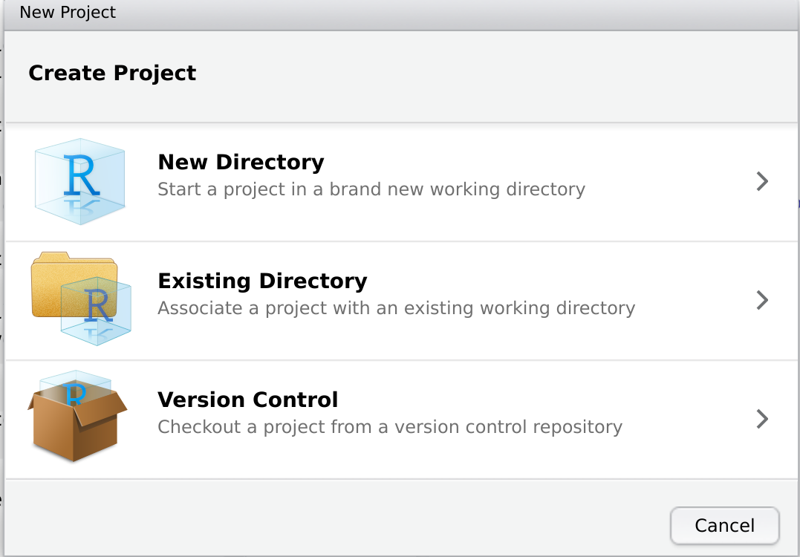
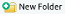
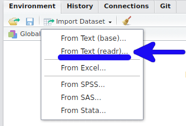
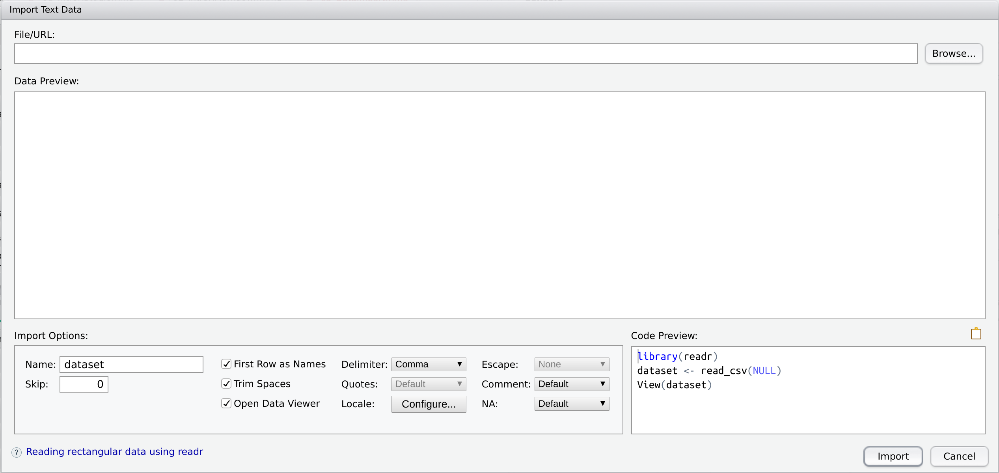
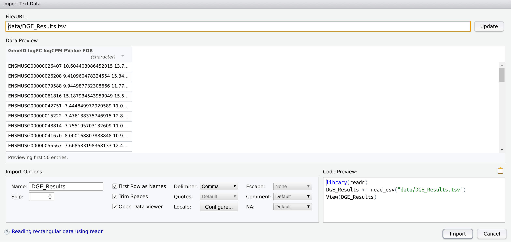
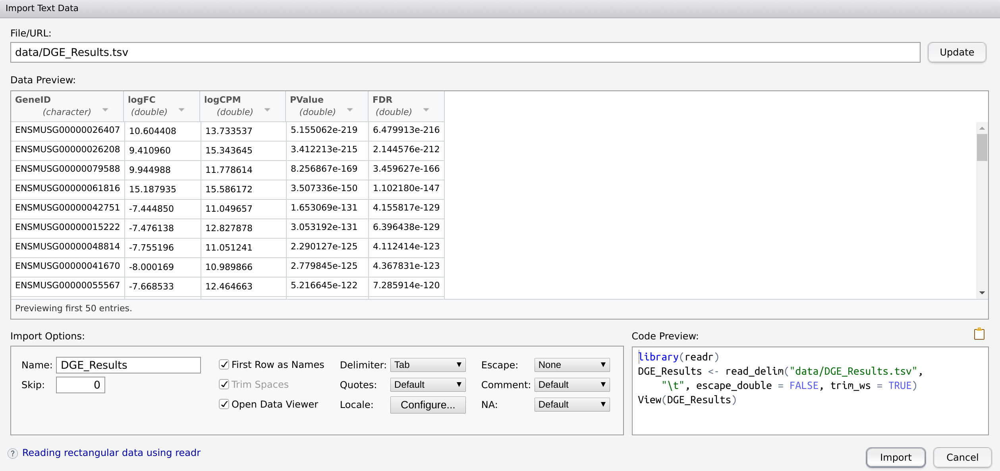

```{r setup, include=FALSE}
knitr::opts_chunk$set(
    echo = TRUE,
    message = FALSE,
    warning = FALSE,
    fig.align = "center",
    results = "hide"
)
if (interactive()) setwd(here::here("Day_1"))
```

## Introduction

For the rest of today's sessions, we'll be working with the results from an RNA-Seq dataset.
We're actually going to start with the final results and learn how to import data, manipulate data and visualise data.
Hopefully you'll see the immediate usefulness of what we're showing you.

We'll take you through a couple of setup steps first, that are similar to what a professional bioinformatician would to.

### R Projects

Before we go any further, we strongly encourage the use of a feature of R Studio called *R Projects*.
These are just a simple and convenient way of organising your code and your data.
For this course our analysis will be relatively simple, but as you go, you may see the importance of keeping everything well organised.

If you go to the **Files** tab in the pane at the bottom right, you should notice that you are in your `Home` directory, as is visible with the  symbol at the top of this pane.
We're going to create an R Project in a subdirectory of this called "Day_1".
Please follow these steps **exactly**, and pay particular attention to capital letters and underscores.
We'll need to have these all identical to what we tell you otherwise you're just going to make your own life difficult and you'll end up horribly confused.
Bioinformatics is very much like that.
Near enough is never good enough, and commands need to be typed exactly.
Laziness leads to confusion.

1. Go to the `File` menu at the top of R Studio and select `New Project...`.
The following dialog will appear:

    ```{r, echo=FALSE, out.width='50%', results='asis'}
    
    ```

2. Select **New Directory**, then **New Project**  
3. Type the name **Day_1** exactly in the first space in the dialog box that appears  
4. Click on **Create Project**  

This will have created a new directory called **Day_1** in your home directory, and inside that directory (using the **Files** Tab) you'll see the file `Day_1.Rproj`.
You'll also notice that at the top right of your R Studio session there is a blue cube with Day_1 next to it.
This is where R Studio keeps a list of your current and recent projects.
We strongly encourage using a new R Project for each dataset as it will help you keep your data organised.
They are really nothing more than a wrapper to your directory, but they do make our lives easier.


### Getting today's data

Now we have our directories organised, we can get today's data.
We'll put it inside a directory called `data` within our R Project, so let's first create this directory.
In your **Files** Tab, click the  icon, and call the directory `data`.

We've already placed the data for today on your VM in a general directory called `data`, so using the **Files** tab, navigate to your Home directory by clicking the  icon.
Inside this directory you'll see another one called `data`, so let's enter that and select the check-box next to the file `DGE_results.tsv`.
Now click the `More` drop-box next to the cog in the **Files** pane, then choose `Move...`, and move this file into your R Project subdirectory data (_i.e._ in `~/Day_1/data`).
Call a tutor over if you're not sure.

Once we've got that all setup the same for everyone, we'll be off and running!

Just to check you have everything right, please copy and paste the following line of code into your R Console.
If you get `FALSE` call a tutor over, but hopefully you'll see `TRUE`.

```{r, eval=FALSE}
file.exists("data/DGE_Results.tsv")
```

Note the suffix this file has.
We often see `csv` files which are *comma separated values*, but this is a `tsv` file, which stands for *tab separated values*.
These are very common in the bioinformatics world.

## Importing Data

As we mentioned earlier this morning, to work with our data in R, we need to bring it into our R Environment.
To do this we load the file from the disk, but importantly once we've read it in, we're not working directly with the file any more.
It can just stay on our hard drive being happily ignored from then on.
This is vastly different to working with Excel, and means the risk of accidentally overwriting our original data is much lower.
All of the manipulation we do will instead be written as code and performed on the R object we create after importing the data.

### Using the GUI

The easiest way to import a file is to use a GUI, so let's start there.
Go to your **Environment** tab and click the `Import Dataset` icon.
From there, we'll need to select the second item as shown below:

```{r, echo=FALSE, out.width='40%', results='asis'}

```

Once we've chosen `From Text (readr)...`, you should see the following dialog box.

```{r, echo=FALSE, out.width='100%', results='asis'}

```

Click the <kbd>Browse</kbd> button and navigate to the file `data/DGE_Results.tsv`.
At this point, you should see something very similar to the following:

```{r, echo=FALSE, out.width='100%', results='asis'}

```

There are a few things to talk through here, but they're all pretty sensible, so do ask a tutor if you're concerned about any of it.

In the `Data Preview` panel, you can see what looks like one column of data.
By default, this GUI has expected a `csv` file, but we've given it a `tsv` file.
The way to fix this is to look at the bottom-left panel, then select the drop-down menu next to the word `Delimiter`, and change this from `Comma` to `Tab`.
Now, all of the columns we expect will have appeared and you'll see the following.

```{r, echo=FALSE, out.width='100%', results='asis'}

```

As you can see, we have a preview of the data in the centre of this dialog box, with 5 columns visible.
R uses the first row in the file to guess the number of columns, and as it has found 5 tab-separated values in this first line, it has applied this assumption to the entire file.
Fortunately, this is a sensible option for this file, but sometimes we may end up with slightly more challenging files.

Notice that under each column name, we have a description of what type of data we have in that column.
In Excel, we generally don't pay any attention to this, but in R it can be quite important.
The first column is classed as `character`, meaning it's plain text, whilst the rest have been classed as `double`.

In R we can have to main types of number, these being an `integer` and a `double`.
Integers are whole numbers, whilst doubles refer to the idea of a *double precision* value, which basically just says we can have double the amount of numbers after the decimal point than we could with single precision.
Single precision numbers were in heavy use when we all had 32-bit operating systems, but since the advent of 64-bit we mainly use double precision numbers.
In short, a) doubles can represent numbers with fractional parts, and b) integers are whole numbers.

The other types of values we can have here can be seen by clicking one of the arrows. 
Of special mention are:

- `Guess`, where R will try to guess what type of value we have
- `Skip`, where we can tell R to skip an entire column
- `Factor`, which is R's way of defining a categorical variable
- `Numeric` which tells R to guess either a `double` or an `integer`

You may have also noticed that when we changed the Delimiter to `Tab` that in the box at the bottom-right, the code changed.
(If you'd like to observe this in action, click `Cancel` and repeat the above).
This is the code that R is executing when we import the file and there are three lines here.

1. `library(readr)` loads the package `readr`.
Packages are collections of functions (`sum()`, `mean()` etc. are actually part of a package called `base` which is always loaded with your R Session), and `readr` has a collection of functions which enable you to read (or import) data into R.
2. `DGE_Results <- read_delim("data/DGE_Results.tsv", "\t", escape_double = FALSE, trim_ws = TRUE)` is the actual command we'll use to load the data. We'll step through this in detail in the next paragraph
3. `View(DGE_Results)` will open a data preview window after the data has been imported.

Returning to that second line, we have some really important points to understand.

1. Notice the use of the `<-` operator, which we came across earlier.
Here we are going to place the results from `read_delim(...)` into an R object called `DGE_Results`
2. When we changed the delimiter to `Tab`, what was originally `read_csv(...)` changed to `read_delim(...)` in this section. 
`read_delim()` allows a choice of more delimiters than `read_csv()`, which defaults to a comma.
After the file path, you'll see `"\t"` which is how we specify a tab delimiter.
**Try changing the delimiter to a semi-colon using the drop-down menu and see what happens to this field and to the file preview.**
Make sure you reset it to `Tab` once you're done though.
3. The two remaining arguments (`escape_double = FALSE, trim_ws = TRUE`) are not super-important, but these can be set by the other check-boxes and drop-down menus.
The argument `trim_ws = TRUE` tells R to remove any white-space around the values in each 'cell'.

**Using your mouse/touchpad select all of the code in this box and copy it to your clipboard.**
Once you've done that, click the <kbd>Import</kbd> button and see what happens.

You'll see that data preview tab appear in your script window in a familiar spreadsheet-like layout.
We never work with data in that tab.
It's just there to make Excel lovers feel happier.
Let's close it and be grownups.

Moving to our **Environment** Tab, you'll see that now we have an object in our Environment called `DGE_Results`.
(The GUI guessed that name by dropping the `.tsv` suffix from our file).
Click the blue arrow next to the object name and you'll see a bit more information about the object.
**See if you can figure out what everything means.**

Formally, this has been loaded into R as an object type known as a `tibble`, which is a type of `data.frame`.
These are very spreadsheet-like data structures in R, which have a strict row/column layout.
Importantly, **every column can only contain one data type**, which is why we went through a bit of that exploration earlier.

Because this is a `tibble`, we can also just type the object name into the R Console and a more R-like preview will be printed out.

```{r, eval=FALSE}
DGE_Results
```

### Making Import Reproducible

As you may be able to tell, this is not particularly reproducible and we have just clicked a few menu items and buttons.
Every time we wished to repeat this operation, we would have to go through all of those clicks again, but there is a far better way!

Using the R Studio menu, select `File > New File > R Markdown` and our familiar dialog box will open up.
Set your name as the author and set the name of the document as "Analysis of Gene Expression".
Once you have the R Markdown document open:

1. Save this as `DGE_Analysis.Rmd` in your `Day_1` main project folder (_i.e._ NOT in the data folder).
2. Delete everything below the YAML header
3. Create a new code chunk by typing `` ```{r}``
4. Close the code chunk by going to the next line and typing `` ``` ``.
5. Between the chunk opening and closing lines, create a new line and **paste the 3 lines you copied from the GUI** into this chunk.

```{r, eval=FALSE}
library(readr)
DGE_Results <- read_delim("data/DGE_Results.tsv", "\t", escape_double = FALSE, trim_ws = TRUE)
View(DGE_Results)
```

Click the green 'play' arrow on the RHS of the chunk and you'll see all three lines be executed once again.
We don't really need that final preview line as this is only for interactive sessions, and generally only beginners use this.
Close the data preview and remove the line that says `View(DGE_Results)`.

Now, to really have some fun, in the **Environment** tab, click the broom () icon.
(Click <kbd>Yes</kbd> when you get the next dialog.)
This will clear all objects from your environment and you'll see the object `DGE_Results` disappear from this tab.
Now it's gone from your R Environment, but we can easily get it back, by just running that chunk again!
This is why we kept our code, and as you can imagine this step is now easily reproducible both now and into the future.

To go further, add the command `DGE_Results` to the end of this chunk, then **Knit** the R Markdown document.
This will give you a preview of the object `DGE_Results` and for `tibble` objects, can be just as handy as using the `View()` functionality.

## Understanding R Functions

Let's dig even deeper to make sure we understand what we've done.
Head to the help page for `read_delim()` by entering `?read_delim` in your R Console.
At the top of this page you'll see some pretty overwhelming text:

```
read_delim(file, delim, quote = "\"", escape_backslash = FALSE,
  escape_double = TRUE, col_names = TRUE, col_types = NULL,
  locale = default_locale(), na = c("", "NA"), quoted_na = TRUE,
  comment = "", trim_ws = FALSE, skip = 0, n_max = Inf,
  guess_max = min(1000, n_max), progress = show_progress(),
  skip_empty_rows = TRUE)
```

Each R function comes with a defined set of arguments that we can modify as needed.
Although the above looks a little overwhelming we can get ourselves a nice simpler version of this by typing `formals(read_delim)` into the R Console.
This will give us a list of all the arguments, in order.
Some of them appear empty, whilst others appear to have values.

The first argument (`file`) is where we told the function to look for the file.
We placed `"data/DGE_Results.tsv"` here, and because that is the first value we passed to `read_delim()`, we didn't need to specify this argument by name.
We could also have put `"file = data/DGE_Results.tsv"` into the function call, and this would've had the same effect.

The second argument (`delim`) is where we specified the delimiter as `"\t"`.
This is the second argument, and because we passed this to the function as the second argument, we again didn't need to specify the argument name.

Notice that the rest of the arguments in the output of `formals()` have values associated with them.
These are the *default values* specified by the function authors.
Most of these are beyond the scope of what we need to know, but a handful of commonly used arguments are:

- `col_names`: The default value of `TRUE` tells R to use the first line in the file as column names. If we set this to `FALSE` the first line would be set as the first row, and default column names of `X1`, `X2` to `X5`.
- `col_types`: Look at the help page itself to see what the explanation for this is. *Call a tutor if this isn't clear.*
- `na`: tells R how any missing value are encoded in the file. We don't have any of these today, but sometimes we have data from collaborators with values like `-`, or `#N/A` or `9999` to indicate missing measurements, so this can be very useful to know about.
- `comment`: can be used to let R know what any comment lines begin with. Sometimes we have to load files where meaningful information is included at the start (or end) prefaced by a comment symbol such as `#`
- `skip`: If we wish to skip an initial number of lines we can tell R to ignore them here.

Also note that there is a function described here called `read_tsv()`.
This is just a wrapper to `read_delim()` but with the `delim` argument set to `"\t"` automatically, as well as `trim_ws = TRUE`.
Try changing your chunk to use `read_tsv("data/DGE_Results.tsv")`.
This will be identical to what we originally had, but may be even easier to read back in the future when you're revising your code.


