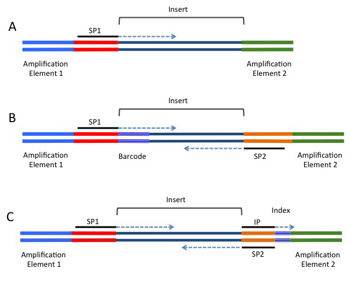

# Day 3

```{r setup, include=FALSE}
knitr::opts_chunk$set(
    echo = TRUE,
    message = FALSE,
    warning = FALSE,
    fig.align = "center",
    results = "hide"
)
if (interactive()) setwd(here::here("Day_2"))
```
## Welcome

Welcome to Spring Into Bioinformatics for 2019.
Over this 3 day course we'll hopefully cover enough concepts to get you started with your data and analyses.
This course will provide the most benefit if you continue to use the skills in the weeks directly after the course, and is aimed at those with minimal to no prior bioinformatics expertise.
Course material will be available at this URL indefinitely.

Most of the sessions will be self-guided, with key direction provided sporadically at important times.
Please ask as many questions as you need.
The tutors are specifically here to help you understand and develop your skills, so please ensure you take full advantage of their availability.

We strongly encourage you to a) read all of the notes, and b) manually type **all of the code** (unless directed otherwise).
This will provide you with the the most benefit.


### Tutors

This course was primarily written by members of the Bioinformatics Hub and the tutors across the three days will be:

- Nathan Watson-Haigh, Dan Kortschak and Mark Armstrong (Bioinformatics Hub Staff)
- Jimmy Breen (Bioinformatics Hub / SAHMRI)
- Nhi Hin (PhD Candidate, Bioinformatics Hub)
- Melanie Smith (PhD Candidate, Robinson Research Institute)
- Terry Bertozzi (SA Museum)

## Working with NGS Data, Data Quality Checks and Data Alignment

Continuing on with the format of this course this last day is where we are going to learn the initial steps needed to process high-throughput sequencing data. 
In Day 1 we learnt how to analyse and organise data in `R`, use important data processing packages contained in the `tidyverse` ecosystem, and perform plots that you would commonly create for Transcriptome sequencing projects (e.g. Volcano plot, Mean-difference plot etc). 
In Day 2 we learnt how to quantify aligned data and create a gene counts table, run common functions to assess sample and project quality (unsupervised clustering and estimation of library sizes) and perform differential expression analyses.

Next-generation sequencing (NGS) has become an important tool in assessing biological signal within an organism or population.
Stemming from previous technologies that were costly and time-consuming to run, NGS platforms are relatively cheap and enable the investigation of the genome, transcriptome, methylome etc at extremely high resolution.
The high-throughput of these machines also has unique challenges, and it is important that scientists are aware of the potential limitations of the platforms and the issues involved with the production of good quality data.

On this third day, we will introduce the key file types used in genomic analyses,
illustrate the fundamentals of Illumina NGS technology (the current market leader in the production of sequencing data),
describe the affect that library preparation can have on downstream data,
and run through a NGS pipeline from raw sequencing data through to aligning the data against a reference genome and preparing it for the analysis on day 2.

### Today's Schedule

- Session 1: A rundown of NGS concepts and setting up the VM.
  - What is Next Generation Sequencing
  - NGS pipelines in bash
  - Effect of library preparation on raw data
  - Introduction FASTQ file format

- Session 2: FastQC and Adapter Removal
  - Data quality checks on raw data
  - Interpreting FastQC output
  - Adapter Removal

- Session 3: Quality Check and STAR Alignment
  - Data quality checks on trimmed data
  - Interpreting changes in FastQC output
  - Introduction to STAR
  - Data alignment with STAR

- Session 4: Indexing with SAMtools
  - Introduction to SAMTools
  - Indexing of aligned files
  - Introduction to IGV
  - Viewing aligned and indexed files with IGViewer
  - Wrap up and Close

## Setup the directory for today

Just as we've created a new R Project for Days 1 and 2, let's create a new one for today to make sure we're all in the same place.
We will not be writing R code today, but we will be using the terminal from within R studio to run bash commands.

- Using the `File` menu at the top left, select `New Project`
- Select `New Directory`
- Select `New Project`
- If you're not already asked to create this project as a subdirectory of `~`, navigate to your home directory using the <kbd>Browse</kbd> button 
- In the `Directory Name` space, enter `Day_3`, then hit the <kbd>Create Project</kbd> button.

This again helps us keep our code organised and is good practice.
To run bash commands, open RStudio as you have for the previous practicals and make sure the `Console` window is visible.
Inside this pane, you will see a **Terminal** Tab so click on this and you will be at an interactive terminal running `bash`.
  
# Next Generation Sequencing

## Introduction to NGS
Before we can begin to analyse any data, it is helpful to understand how it was generated. Whilst there are numerous platforms for generation of NGS data, today we will look at the Illumina Sequencing by Synthesis method, which is one of the most common methods in use today.
Many of you will be familiar with the process involved, but it may be worth looking at the following [5-minute video from Illumina](http://youtu.be/womKfikWlxM).
As setting up the sound with the VMs can be tricky, it will be easier to view this from your own regular browser.
Briefly minimise the VM, open your regular browser and please use your headphones if you brought them.

This video refers to the process tagmentation.
This is a relatively recent method for fragmenting and attaching adapters to DNA, with an alternative, more traditional methods being sonication, poly-adenylation and attachment of appropriate adaptors in separate steps.
This step may vary depending on your experiment, but the important concept to note during sample preparation is that the DNA insert has multiple sequences ligated to either end.
These include 1) the sequencing primers, 2) index and/or barcode sequences, and 3) the flow-cell binding oligos.
To demonstrate these concepts further, observe the following figure that shows the DNA construct needed to run an illumina sequencing run, and the amplification steps required:



## Library preparation batch effects

It is important to be aware that as there are multiple library preparation steps, each of these offer opportunities for confounding factors and biases to be introduced.
Variation and bias can be introduced during library construction due to random hexamer mispriming, contamination by off-target transcripts, fragmentation size or the amplification of PCR artifacts.
With different runs on different machines you can get other sources of variability due to sequencing protocols, the device used (e.g. IonTorrent, Illumina, PacBio) and the sequencing depth.
All of these sources of variability with the data can lead to so-called `batch effects` which may need to be compensated for in the experimental design if the samples being compared were not processed in the same experimental run.


## FASTQ File Format

As the sequences are extended during the sequencing reaction, an image is recorded which is effectively a movie or series of frames at which the addition of bases is recorded and detected.
We mostly don’t deal with these image files, but will handle data generated from these in fastq format, which can commonly have the file suffix .fq or .fastq.
As these files are often very large, they will often be zipped using gzip or bzip.
Whilst we would instinctively want to unzip these files using the command gunzip, most NGS tools are able to work with zipped fastq files, so decompression (or extraction) is usually unnecessary.
This can save considerable hard drive space, which is an important consideration when handling NGS datasets as the quantity of data can easily push your storage capacity to its limit.

We should still have a terminal open from the previous section (See `Setup the directory for today`).
If necessary, use the cd command to make sure you are in the `Day_3` folder within the home (~/Day_3) directory.

```
cd ~/Day_3/
```

You must ensure that you use this _exact_ path as any variations will undoubtedly cause you problems and lead to unnecessary confusion later on.
You can use the command `pwd` to ensure the path you are in is correct.

Use the `mkdir` command to create a new folder called `rawData` within your `Day_3` folder, which will be the location for raw FASTQ files we have obtained from a sequencing system.

```
mkdir rawData
```

We now want to use the `cp` command to copy the raw FASTQ files to your new rawData folder

```
cp ~/data/Day_3/rawData/* ~/Day_3/rawData/
ls ~/Day_3/rawData/
```

The command `zcat` unzips a file and prints the output to the terminal, or standard output (stdout).
If we did this to these files, we would see a stream of data whizzing past in the terminal, but instead we can just pipe the output of zcat to the command head to view the first 10 lines of a file.

```
cd ~/Day_3/rawData
zcat SRR945375.skm.fastq.gz | head
```

Using the argument `-n` we can modify the behaviour of head to return a specified number of lines, for example `-n8` will return the first 8 lines of a file.

```
zcat SRR945375.skm.fastq.gz | head -n8
```

You may also remember the pipe symbol `|` from the above command from day 2.
In this example we have taken the output of the zcat command (`zcat SRR945375.skm.fastq.gz`) and redirected it to another command (`head`).
There are no limits to the number of commands we can string together using pipe commands, allowing us to create pipelines for data from a source through to a destination via different transformations.

In the output from the above terminal command, we have obtained the first 8 lines of the gzipped fastq file.
This gives a clear view of the fastq file format, where each individual read spans four lines.
These lines are:


    1. The read identifier
    2. The sequence read
    3. An alternate line for the identifier (commonly left blank as just a + symbol acting as a placeholder)
    4. The quality scores for each position along the read as a series of ascii text characters.

Let’s have a brief look at each of these lines and what they mean.

## The read identifier

This line begins with an @ symbol and although there is some variability, it traditionally has several components.
The data we have been working with over the last 3 days was sourced from an EBI data repository, and this particular file has the identifier SRR945375.
For the first sequence in this file, we have the full identifier `@SRR945375.39 HWI-ST1145:52:D0PV8ACXX:3:1101:14387:1975:213/1` which has the following components:


    | @SRR945375.39 | The aforementioned EBI identifier and the sequence ID within the file.
        If this was the first read, we would have the number 1.
        However as this is a chromosome 1 subset from a genome dataset, so this particular file begins at read number 39.
        NB: This identifier is not present when data is obtained directly from the machine or service provider.|
    | HWI-ST1145:52:D0PV8ACXX | The unique machine ID |
    | 3 | The flowcell lane |
    | 1101 | The tile within the flowcell lane |
    | 14387 | |
    | 1975 | The x-coordinate of the cluster within the tile |
    | 213 | The y-coordinate of the cluster within the tile |
    | /1 | Indicates that this is the first read in a set of paired-end reads |

As seen in the subsequent sections, these pieces of information can be helpful in identifying if any spatial effects have affected the quality of the reads.
By and large you won’t need to utilise most of this information, but it can be handy for times of serious data exploration.

## Quality Scores

The only other line in the fastq format that really needs some introduction is the quality score information.
These are presented as single ascii text characters for simple visual alignment with the sequence, and each character corresponds to a numeric value, which is the quality score.
In the ascii text system, each character has a numeric value which we can interpret as an integer.
Head to the website with a description of these at [ASCII Code table](http://en.wikipedia.org/wiki/ASCII#ASCII_printable_code_chart).

The first 31 ASCII characters are non-printable and contain things like end-of-line marks and tab spacings, and note that the first printable character after the space (character 32) is "!" which corresponds to the value 33.
In short, the values 33-47 are symbols like !, #, $ etc, whereas the values 48-57 are the characters 0-9.
Next are some more symbols (including @ for the value 64), with the upper case characters representing the values 65-90 and the lower case letters representing the values 97-122.

## The PHRED +33/64 Scoring System

Now that we understand how to turn the quality scores from an ascii character into a numeric value, we need to know what these numbers represent.
The two main systems in common usage are PHRED +33 and PHRED +64 and for each of these coding systems we either subtract 33 or 64 from the numeric value associated with each ascii character to give us a PHRED score.
As will be discussed later, this score ranges between 0 and about 41.

The PHRED system used is determined by the software installed on the sequencing machine, with early machines using PHRED + 64 (casava <1.5), and more recent machines tending to use PHRED + 33.
For example, in PHRED +33, the @ symbol corresponds to Q = 64 - 33 = 31, whereas in PHRED +64 it corresponds to Q = 64 - 64 = 0.

The following table demonstrates the comparative coding scale for the different formats:

```
SSSSSSSSSSSSSSSSSSSSSSSSSSSSSSSSSSSSSSSSS.....................................................
..........................XXXXXXXXXXXXXXXXXXXXXXXXXXXXXXXXXXXXXXXXXXXXXX......................
...............................IIIIIIIIIIIIIIIIIIIIIIIIIIIIIIIIIIIIIIIII......................
.................................JJJJJJJJJJJJJJJJJJJJJJJJJJJJJJJJJJJJJJJ......................
LLLLLLLLLLLLLLLLLLLLLLLLLLLLLLLLLLLLLLLLLL....................................................
!"#$%&’()*+,-./0123456789:;<=>?@ABCDEFGHIJKLMNOPQRSTUVWXYZ[\]ˆ_‘abcdefghijklmnopqrstuvwxyz{|}~
|                         |    |        |                              |                     |
33                       59   64       73                             104                   126
S - Sanger Phred+33, raw reads typically (0, 40)
X - Solexa Solexa+64, raw reads typically (-5, 40)
I - Illumina 1.3+ Phred+64, raw reads typically (0, 40)
J - Illumina 1.5+ Phred+64, raw reads typically (3, 40)
L - Illumina 1.8+ Phred+33, raw reads typically (0, 41)
```

## Interpretation of PHRED Scores

The quality scores are related to the probability of calling an incorrect base through the
formula

*Q =* −10log<sub>10</sub>*P*  

where *P* is the probability of calling the incorrect base.
This is more easily seen in the following table:

| PHRED Score | Probability of Incorrect Base Call | Accuracy of Base Call |
|:----------- |:---------------------------------- |:----------------------|
| 0           | 1 in 1          | 0%          |
| 10          | 1 in 10         | 90%         |
| 20          | 1 in 100        | 99%         |
| 30          | 1 in 1000       | 99.9%       |
| 40          | 1 in 10000      | 99.99%      |

Now we understand how quality scores are encoded in the FASTQ file, it gives us a basis for understanding how the rest of quality control process works.
The FastQC application which compiles and reports on FASTQ file data quality is covered in the next session.


