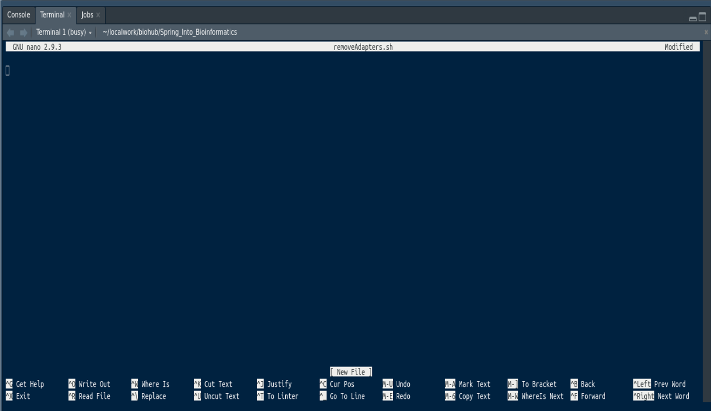

# Day 3

```{r setup, include=FALSE}
knitr::opts_chunk$set(
    echo = TRUE,
    message = FALSE,
    warning = FALSE,
    fig.align = "center",
    results = "hide"
)
if (interactive()) setwd(here::here("Day_2"))
```
## Our Dataset

For the majority of today, we'll be working with an RNA-Seq dataset.
As mentioned over the last 2 days, this is part of a larger aging study from a group researching differences between brain and muscle tissue in mice and humans during their evolutionary divergence. 
We have 4 skeletal muscle samples and 4 cerebellar cortex samples to compare for expression differences, which you performed on day 2.
Our goal here on day three is to produce an aligned dataset suitable for gene expression analysis.

# Quality Control


## Using FastQC

A common tool for checking the quality of a FASTQ file is the program FastQC.
As with all programs on the command line, we need to see how it works before we use it.
The following command will open the help file in the less pager which we used earlier.
To navigate through the file, use the `<spacebar>` to move forward a page, `<b>` to move back a page & `<q>` to exit the manual.

```
fastqc -h | less
```

FastQC will create an html report for each file you provide, which can then be opened from any web browser such as firefox.
As seen in the help page, FastQC can be run from the command line or from a graphic user interface (GUI).
Using a GUI is generally intuitive so today we will look at the command line usage, as that will give you more flexibility & options going forward.
Some important options for the command can be seen in the manual.
As you will see in the manual, setting the `-h` option as above will call the help page.
Look up the following options to find what they mean.

| Option | Usage |
|:------ |:------|
| `-o`     |       |
| `-t`     |       |

The VMs we're all using have two cores so we can set the parameter `-t 2`.
We can also write to the output folder that we've already created above.
Let's run FastQC on all of our files and see what we get.
You will also need to create the FastQC in the Day_3 folder.
(Make sure you're in the `~/Day_3/` folder first.)

```
cd ~/Day_3/
mkdir -p 0_rawData/FastQC/
fastqc -t 2 -o 0_rawData/FastQC/ 0_rawData/fastq/*
```

This will have created a FastQC report for every file as an html file which we can normally view using any web browser.

```
ls 0_rawData/FastQC/
```

As the files are on the VM we have two options to view them:
  1) copying them to your local machine (i.e. laptop) using `scp`
  2) using RStudio to have a look at the files
  
## Opening RStudio

 ## description here on accessing HTML files on VM via RStudio - I'm not sure how this works

## Inspecting a FastQC Report

The left hand menu contains a series of click-able links to navigate through the each module contained in the report, with a quick guideline about each module given as a tick, cross or exclamation mark.
Some of these are not particularly informative, and the modules we can reasonably ignore in the vast majority of cases are:

1. Per tile sequence quality
2. Per sequence quality scores
3. Per base N content
4. Kmer Content (if it's even included)

#### Questions
{:.no_toc}

1. *How many sequences are there in all files?*
2. *How long are the sequences in these files?*

## Interpreting the FastQC Report

As we work through the QC reports we will develop a series of criteria for cleaning up our files.
There is usually no perfect solution, we just have to make the best decisions we can based on the information we have.
Some sections will prove more informative than others, and some will only be helpful if we are drilling deeply into our data.
Firstly we’ll just look at a selection of the plots.
We’ll investigate some of the others with some ‘bad’ data later.

### Per Base Sequence Quality
{:.no_toc}

Click on the `Per base sequence quality` hyper-link on the left of the page & you will see a boxplot of the QC score distributions for every position in the read.
These are the PHRED scores we discussed earlier, and this plot is usually the first one that bioinformaticians will look at for making informed decisions about the overall quality of the data and settings for later stages of the analysis.

*What do you notice about the QC scores as you progress through the read?*

We will deal with trimming the reads in a later section, but start to think about what you should do to the reads to ensure the highest quality in your final alignment & analysis.

As this is RNA-Seq data, we'll mainly be quantifying the number of reads which align to a gene. 
**Will the actual sequence content be vital for us?**
Now consider a whole-genome-sequencing (WGS) experiment where we are wanting to identify SNPs or other genomic variants.
Would the actual sequence content be vital for us now?


**Per Tile Sequence Quality**<details>
This section just gives a quick visualisation about any physical effects on sequence quality due to the tile within the each flowcell or lane.
Generally, this would only be of note if drilling deeply to remove data from tiles with notable problems.
Most of the time we don’t factor in spatial effects, unless alternative approaches fail to address the issues we are dealing with.
</details>

**Per Sequence Quality Scores**<details>
This is just the distribution of the average quality scores for each read, obtained by averaging all the scores at each base within a read.
There’s not much of note for us to see here.
</details>

**Per Base Sequence Content**<details>
This will often show artefacts from barcodes or adapters early in the reads, before stabilising to show a relatively even distribution of the bases.
  Here FastQC may have flagged this as a 'fail' and you will see considerable variability in the first few bases.
  This is actually very normal for RNA seq and is a consequence of non-random fragmentation and non-random adapter ligation.
  It's also relatively common to see a drift towards G towards the end of a read. This can be a bit more troubling (ask a tutor to explain) but is usually remedied as we trim our reads in the next step.
</details>

**Sequence Length Distribution**<details>
This shows the distributions of read lengths in our data. If the length of your reads is vital (_e.g._ smallRNA data), then this can also be a very informative plot. For our data, it appears that some trimming has already been performed. This was done by the sequence provider, much to our disappointment.
  It's actually quite common for this to happen, it's just the bioinformaticians love to know everything about every step that was performed.
  It's also not uncommon for Illumina's adapter removal tools to leave quite a few there and you then have to trim yet again.
</details>

**Sequence Duplication Levels** This plot shows about what you’d expect from a typical NGS experiment.
There are a few duplicated sequences (rRNA, highly expressed genes etc.) and lots of unique sequences representing the diverse transcriptome.
This is only calculated on a small sample of the library for computational efficiency and is just to give a rough guide if anything unusual stands out.
Things to watch for here are peaks on the far right which would indicate massive overrepresentation of a few sequences above the rest of the source material.

**Overrepresented Sequences** Here we can see any sequence which are more abundant than would be expected. Sometimes you'll see sequences here that match the adapters used, or you may see highly expressed genes here.

**Adapter Content** This can give a good guide as to our true fragment lengths. If we have read lengths which are longer than our original DNA/RNA fragments (_i.e._ inserts) then the sequencing will run into the adapters.
If you have used custom adapters, you may also need to supply them to `FastQC` as this only searches for common adapter sequences.
Here, it looks like Illumina's automated tool has a done a pretty reasonable job.

## Some More Example Reports

Let’s head to another sample plot at the [FastQC homepage](http://www.bioinformatics.babraham.ac.uk/projects/fastqc/bad_sequence_fastqc.html)

**Per Base Sequence Quality** Looking at the first plot, we can clearly see this data is
not as high quality as the one we have been exploring ourselves.

**Per Tile Sequence Quality** Some physical artefacts are visible & some tiles seem to
be consistently lower quality. Whichever approach we take to cleaning the data will more
than likely account for any of these artefacts. Sometimes it’s just helpful to know where a
problem has arisen.

**Overrepresented Sequences** Head to this section of the report & scan down the
list. Unlike our sample data, there seem to be a lot of enriched sequences of unknown
origin. There is one hit to an Illumina adapter sequence, so we know at least one of the
contaminants in the data. Note that some of these sequences are the same as others on
the list, just shifted one or two base pairs. A possible source of this may have been non-random fragmentation.

Interpreting the various sections of the report can take time & experience.
A description of each of the sections [is available from the fastqc authors](http://www.bioinformatics.babraham.ac.uk/projects/fastqc/Help/) which can be very helpful as you're finding your way.

Another interesting report is available at http://www.bioinformatics.babraham.ac.uk/projects/fastqc/RNA-Seq_fastqc.html.
Whilst the quality scores generally look pretty good for this one, see if you can find a point of interest in this data.
This is a good example, of why just skimming the first plot may not be such a good idea.

## Working With Complete Datasets

In our dataset, we have 8 samples so it's not too onerous to inspect all 8 individually.
In the real world, we'll often have much larger datasets and looking at FastQC reports for all samples quickly becomes challenging.
A commonly used tool for this is [MultiQC](https://multiqc.info/) however, the team in the Bioinformatics Hub has written an R package to enable this called `ngsReports`.
To use this, first create a folder called `R` in your Day_3 folder to manage R scripts created today.

```
mkdir -p ~/Day_3/R/
```

The package ngsReports is available on Bioconductor, but it is installed already on your VMs so open a new R script and save it in your `R` folder as `FastQC_section.R`.

Once you've done this we can load the package using:

```
library(ngsReports)
```

The simplest method now is to automatically write a summarised report for all of our files using the function `writeHtmlReport()`, which will use a supplied template to combine all of our FastQC reports.
Enter this function name, and then initialise the quotation marks inside the function `writeHtmlReport("")`.
Go back inside the quotation marks then use the tab key to navigate to your FastQC reports, then press enter.
The final command will look something like

```
writeHtmlReport("0_rawData/FastQC/", species="Mmusculus")
```
Once this has completed, use your Files pane to navigate to your FastQC reports again & open the file `ngsReports_Fastqc.html` using your Web Browser.
This will contain a summary of all the files in our dataset.
Take your time scrolling through the report, and note that each plot is interactive so you can hover over various points and see which file you are looking at.

# Adapter and quality trimming of NGS data

Once we have inspected our data and have an idea of how accurate our reads are, as well as any other technical issues that may be within the data, we may need to trim or filter the reads to make sure we are aligning or analysing sequences that accurately represent our source material.
As we’ve noticed, the quality of reads commonly drops off towards the end of the reads, and dealing with this behaviour can be an important part of most processing pipelines.
Sometimes we will require reads of identical lengths for our downstream analysis, whilst other times we can use reads of varying lengths.
The data cleaning steps we choose for our own analysis will inevitably be influenced by our downstream requirements.

## The Basic Workflow

Data cleaning and pre-processing can involve many steps, and today we will use the basic work-flow as outlined below.
Each analysis is slightly different so some steps may or may not be required for your own data, however many workflows do have a little overlap, and some pipelines (_e.g._ *Stacks*) may even perform some of these steps for you.

*A basic workflow is:*

1. **Remove Adapters and Quality Trim** (`AdapterRemoval`)
2. **Run FastQC** on trimmed reads.
3. **Alignment** to a reference (`bwa`, `bowtie2`, `STAR`)
4. **Post-alignment QC** (`picard markDuplicates`, `IGV`)


## Removal of Low Quality Bases and Adapters

Adapter removal is an important step in many sequencing projects, mainly projects associated with DNA/RNA inserts which are shorter than the sequencing read lengths.
A good example of this would be an experiment where the target molecule is small non-coding RNAs.
As these are generally between 19-35bp, which is shorter than the shortest read length provided by Illumina sequencing machines, all reads containing a target molecule will also contain adapters.
In addition, when we size select our initial fragments, we select a range of fragment sizes and some are bound to be shorter than our read length.
Therefore it is important to trim adapters accurately to ensure that the genome mapping and other downstream analyses are accurate.

In the early years of NGS data, we would run multiple steps to remove both adapters, low quality bases (near the ends of reads) and reads which have overall lower quality scores.
Today's trimming algorithms have become better at removing low-quality bases at the same time as removing adapters.
The tool we'll use for this step today is [`AdapterRemoval`](https://buildmedia.readthedocs.org/media/pdf/adapterremoval/latest/adapterremoval.pdf).

We can trim raw data from Illumina machines using the Illumina paired-end adapters obtained from [this website](https://support.illumina.com/bulletins/2016/12/what-sequences-do-i-use-for-adapter-trimming.html)
These are commonly used in Illumina projects.

**Before we perform adapter trimming, look at the following code.**


```
cd ~/Day_3/
mkdir -p 1_trimmedData/fastq
mkdir -p 1_trimmedData/log
AdapterRemoval \
	--file1 0_rawData/fastq/SRR945375.skm.fastq.gz \
	--output1 1_trimmedData/fastq/SRR945375.skm.fastq.gz \
	--discarded 1_trimmedData/fastq/SRR945375.skm.discarded.gz \
	--minlength 50 \
	--threads 2 \
	--trimns \
	--trimqualities \
	--minquality 20 \
	--gzip \
	--settings 1_trimmedData/log/SRR945375.skm.fastq.gz.settings
```

#### Questions
{:.no_toc}
*1. What do the options* `--minlength 50` *and* `--minquality 20` *specify in the above? Do you think these choices were reasonable?*
*2. Notice the adapter sequence wasn't specified anywhere. Did we miss an important setting?*
*3. What do you expect to find in the file specified using the `--discarded` option?*
*4. What do you expect to find in the file specified using the `--settings` option?*

Run the above code by pasting into your terminal.
Did you guess correctly?

The `AdapterRemoval` tool can be made to output information about the trimming process to a file.
In the above we wrote this output to a "settings" file using the `--settings` option to output this to the `SRR945375.skm.fastq.gz.settings` file.
Let's have a look in the file to check the output.

```
less 1_trimmedData/log/SRR945375.skm.fastq.gz.settings
```

As these were a good initial sample, it's not surprising that we didn't lose many sequences.
Notice that many reads were trimmed (`Number of well aligned reads`), but were still long enough and high enough quality to be retained.

### Trimming using a script

In the above, we manually ran the process on an individual file and manually specified key information about where to write various output files.
In the real world, this is not really a viable option and we'll need to write a script to trim all of our samples.

Before we write this script, let's think about what will be involved.

1 - We'll need to provide a list of input fastq files to work on
2 - We'll need to specify different output files
3 - Some parameters will be constant, whilst others will change for every file

In following excerpts, we'll (hopefully) give you all the clues you need to complete this script, particularly when you look at the actual command we gave to AdapterRemoval above.

**How do we find our files?**

First, create a bash folder to store our bash scripts in.

```
mkdir -p ~/Day_3/bash/
```

Create a new file called `removeAdapters.sh` using whatever script editor you prefer, and save it in the bash folder`bash/removeAdapters.sh`.
If you are unsure, you can use a simple editor called nano to create the script using the command `nano bash/removeAdapters.sh`.
The command will open an empty window in the terminal with a number of available commands shown at the bottom.



Type or copy-paste the following script into the removeAdapters.sh file:

```
#!/bin/bash

# Setup our input directory, then look for the files we need
INDIR=~/Day_3/0_rawData/fastq
INFILES=$(ls ${INDIR}/*fastq.gz)

# Check that we have found the correct files
for f in ${INFILES}
do
    echo "Found ${f}"
done
```

Save your file in your script editor and close. 
If you are using `nano`, exit and save by entering `Ctrl+x` answering `y` when asked if you'd like to save changes.
Let's run the script using `bash bash/removeAdapters.sh`

**Did you see the files you expected returned?**

#### Script explanation

The shebang `#!` at the top of the script file tells the operator which scripting language we want to use, in this case bash `/bin/bash`.
The lines beginning with `#`, apart from the shebang, are comment lines which are used to tell users something about the script or a particular section of script e.g. `# Setup our input directory, then look for the files we need` tells us what the script immediately following the comment will be performing.
These are important to use as they both help us to remember what we were intending to do and to help anyone else looking at our script to follow the logic.

Next we are setting a variable to our input folder using `INDIR=~/Day_3/0_rawData/fastq`.
`INDIR` is the variable and we have set it to the location `~/Day_3/0_rawData/fastq`, which will make later references to the folder location easier to manage.
If we moved out input files then we would only have to change this single assignment within the script, rather than look for all references throughout it.

The line `INFILES=$(ls ${INDIR}/*fastq.gz)` is a little more complex to unpack, as it has a bash command `ls` running within a variable assignment.
The command `ls`, which lists files from a directory location, is passed a folder location and the file type we want the script to find.
The folder location is the variable `INDIR` we created earlier, and bash knows to use this through the dollar sign `$` and braces `{}` surrounding the variable `${INDIR}`.
We have also limited the ls command to our fastq files by appending the variable with `/*fastq.gz`.

In effect we are running the command `ls ~/Day_3/0_rawData/fastq/*fastq.gz`, which if you try yourself will return our sample files.
The results of this ls command are themselves assigned to a new variable called `INFILES` by wrapping the ls command within `$()`, as in `INFILES=$(ls ${INDIR}/*fastq.gz)`.
The variable `INFILES` therefore contains a list of file names and these are accessed individually in the next bash script section using for: `for f in ${INFILES}`.
This assigns the first file to a variable `f` then carrys out the operation following it in the `do ... done` block before assigning the next file to the variable `f`.
In the `do .... done` block example we are running the `echo` command which outputs text strings, and creating a string by joining `"Found ` with the variable `${f}`.
As we have not redirected the output of echo to another application, the output defaults to text on the screen of the user.

In summary the script uses `ls` to look in the folder we assigned it, collects a list of files matching the pattern `*fastq.gz`, and prints out the filenames individually to the screen.


Try changing the second to last line to be the following

```
    echo "Found $(basename ${f})" 
```

**What was the difference?**

The program `basename`, takes a pathname and remove any prefixes up to the last slash.
This effectively removes the input folder we provided at the beginning of the script and the `echo` command will only output the file names themselves to the screen.
Hopefully it will be clear to you that this simple script offers us opportunities to build much more powerful automated tools to run over a group of files.

Now that we've figured how to find our input files and remove the input directory from their names, let's see if we can create new names for output files.
Change your script to be the following.

```
#!/bin/bash

# Setup our input directory, then look for the files we need
INDIR=~/Day_3/0_rawData/fastq
INFILES=$(ls ${INDIR}/*fastq.gz)

# Define our output parent directory
OUTDIR=~/Day_3/1_trimmedData

# Check our output directory exists
if [ ! -d "$OUTDIR" ]; then
    # If the directory doesn't exist, exit with a message and an error
    echo "$OUTDIR does not exist"
    exit 1
fi

# Check that we have found the correct files
for f in ${INFILES}
do
    echo "Found ${f}"
    OUTFILE=${OUTDIR}/fastq/$(basename ${f})
    echo "Trimmed reads will be written to ${OUTFILE}"
done
```
#### Script explanation

We have introduced a couple of new concepts in this script. The `if ... fi` block only executes if the condition within the square brackets `[]` resolves to `TRUE`.
To check if a folder exists we use the construction `if [ -d foldername ];` where -d tells the script we are checking for the existence of a directory called foldername.
As we are interested in reporting if the directory doesn't exist, we use the operator `!` (NOT) so the construction evaluates to TRUE if the directory is not found `if [ ! -d "$OUTDIR" ]`.
By the way take careful note of the spaces in the square brackets as these are necessary and will easily trip up new users if they are missed.
The `exit 1` command will exit out of the script without any further actions, which saves time if the input files are missing and prevents resources being wasted on later processes.
The informative error outputed using `echo` on the line above is also helpful when you want to know why your script failed.

In the `do ... done` block we can see how the `OUTFILE`, or the filename to be created as output, is constructed.
The variable for the output directory `OUTDIR` is appended with the fastq directory name, `/fastq/`, and the filename, provided by `$(basename ${f})`.
As you can see, the `basename` program is used to remove the input directory and leave only the filename itself.

Now you've seen how specify the output file, by using the input file we're nearly there.
**What else do you think we need to specify?**

Add the following lines to your script on a new blank line immediately before our final `done` command.
If you're having trouble with any of this please call a tutor over too!


